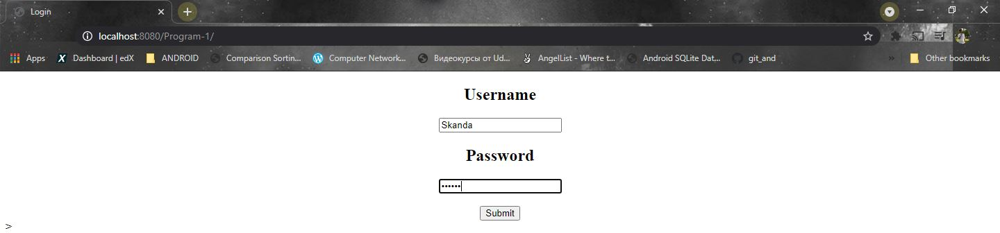
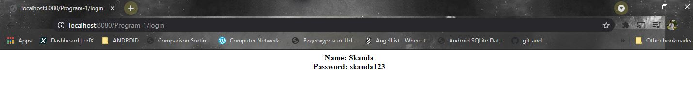

# Program 1

Java Servlet program to implement a dynamic HTML using Servlet.

**Concept Used**

```java
request.getParameter("name");
```

### How to execute?

1. Fork on download in a zip file and extract in your local machine.
2. Open netbeans and choose *open project* and choose the folder which contains the program files.
3. Choose appropriate browser and click run to execute.

##### Screenshot





##### Date: 2/5/2021