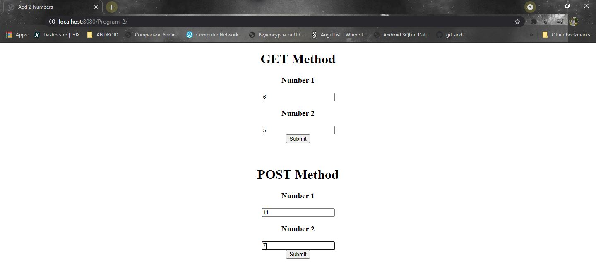
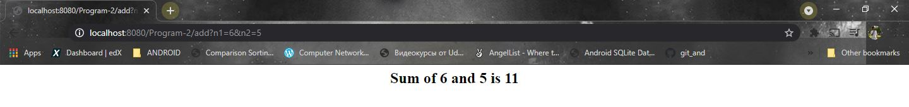
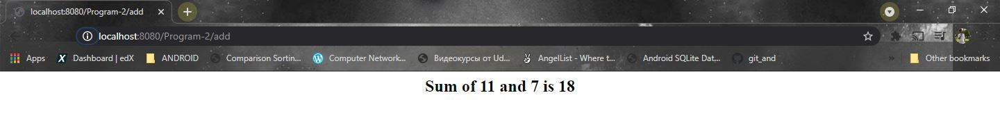

# Program 2

JAVA Servlet program to implement and demonstrate get() and post() methods.

**Adding 2 numbers**

```html
<from action="add" method="POST">
```

```html
<from action="add" method="GET">
```


### How to execute?

1. Fork on download in a zip file and extract in your local machine.
2. Open NetBeans and choose *open project* and choose the folder which contains the program files.
3. Choose the suitable browser and click run to execute.
4. Enter 2 numbers on either of the forms and click submit. Observe the change in the URL to get the difference between *POST* and *GET* methods

### Screenshot

------

**index.html**



**add.java (GET Method)**



**add.java (POST Method)**



##### Date: 2/5/2021