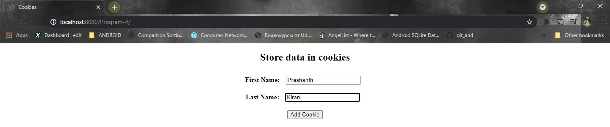
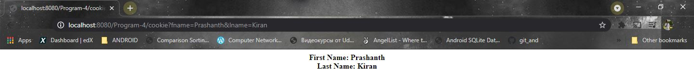
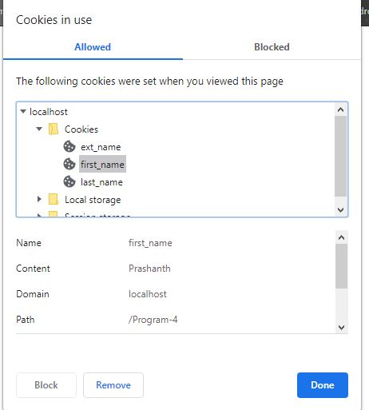

# Program 4

JAVA Servlet program using Cookie to remember user preferences.

**Storing user name in cookie**

```java
Cookie firstName=new Cookie("first_name",request.getParameter("fname")); // creating a cookie
firstName.setMaxAge(60*60*24); // setting maximum age of the cookie
```

### How to execute?

1. Fork on download in a zip file and extract in your local machine.
2. Open NetBeans and choose *open project* and choose the folder which contains the program files.
3. Choose the suitable browser and click run to execute.
4. Enter your name in the TextField and submit the form.
5. Your data will be stored as a cookie and you can check it out by going the desired location and look into the value as well as time to live. 

### Screenshot

------

**index.html**



**cookie.java**



**Cookies Page**



##### Date: 4/5/2021