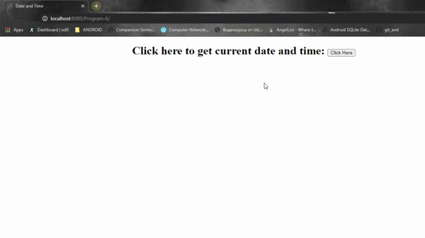

# Program 6

JSP program to demonstrate the import attribute and all the attributes of page directive tag.

**Displaying date and time using JSP**

```java
<%=new java.util.Date() %> // displays current date and time using directive tag
```

### How to execute?

1. Fork on download in a zip file and extract in your local machine.
2. Open NetBeans and choose *open project* and choose the folder which contains the program files.
3. Choose the suitable browser and click run to execute.
4. Click on the button to redirect to the jsp file which displays current date and time. 

### Screenshot

------



##### Date: 8/5/2021